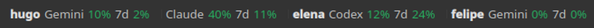
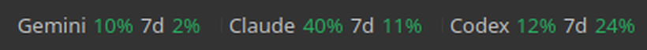
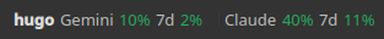
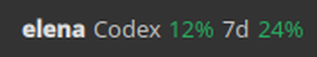
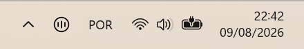
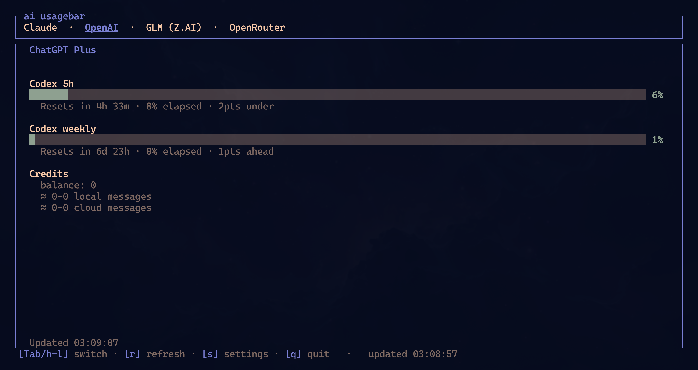
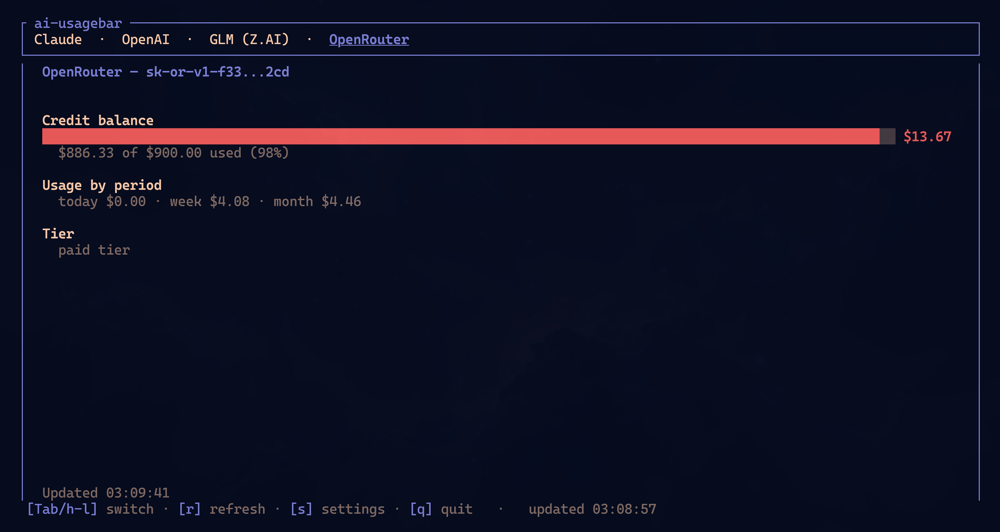

# ai-monitor

See how much of your AI plan you have left, in your panel, for every account
you log in to. ai-monitor tracks the 5-hour and weekly windows of **Claude**,
**Codex/ChatGPT**, **Google Antigravity (Gemini)**, **GitHub Copilot**,
**Z.AI**, **OpenRouter**, **DeepSeek**, **Kimi** and more, and tells you when a
window renews.

It runs on KDE Plasma 6, GNOME, Omarchy, Waybar, the Windows tray, the macOS
menu bar and in a terminal TUI. All of them read the same `config.toml`, so the
panel looks the same on every desktop.

**Author:** Luan Victor



## Display modes

One `[display]` section in `config.toml` decides what the bar shows. Every
frontend reads it, and you can change it from the TUI settings (`s`), the KDE
"Panel & accounts" page, or by editing the file.

With `bar_mode = "expanded"` the bar shows up to `bar_count` items side by
side. An item is a provider…



…or an account with its providers (`bar_unit = "account"`), as in the image at
the top.

With `bar_mode = "carousel"` it shows one item at a time and moves on every
`carousel_interval` seconds. Scroll over the bar to move it yourself; hovering
pauses it on KDE.




The tooltip follows `hover_mode`: `blocks` shows every item at once, and
`pager` shows one item with its position (◀ 2 / 5 ▶) while the scroll wheel
pages through them. Desktop tooltips can't be clicked, so the wheel does the paging.

A click always lists every account in use right now, each with
the providers it is the current session for.

```toml
[display]
bar_mode = "expanded"     # expanded | carousel
bar_count = 3             # items side by side (1-6)
bar_unit = "account"      # provider | account
carousel_interval = 5     # seconds per carousel step (2-300)
hover_mode = "blocks"     # blocks | pager
recent_only = false       # account mode: only each account's recent providers
hidden_accounts = []      # accounts left out of the bar
```

| Frontend | Expanded / carousel | Hover | Where to turn it on |
|---|---|---|---|
| KDE Plasma 6 | yes, wheel steps, hover pauses | blocks / pager | on by default |
| Waybar | yes, carousel follows `interval` | blocks / pager (wheel) | `exec: ai-monitor --panel` |
| GNOME Shell | yes | dropdown lists all | Preferences → Layout → Shared panel |
| Omarchy | yes, wheel steps | summary tooltip | bar setting `sharedPanel` |
| Windows tray | hover tip + "In use now" card | one line per item | on by default |
| macOS menu bar | yes | hover tip + dropdown | Switch provider → Shared panel |

## Features

Every account you log in to is picked up and monitored automatically. An
account can have one provider or several, and each keeps its own history, so
switching accounts never overwrites another account's figures.

`ai-monitor monitor --install-service` starts the monitor at login (systemd
user unit, macOS LaunchAgent, or a Windows sign-in entry). It watches the 5-hour and weekly
windows of every account and sends one desktop notification when windows
renew: `notify-send` on Linux, Notification Center on macOS, toasts on
Windows. KDE also shows a 🔔 badge. Dismissed alerts stay dismissed, and a
renewal that happened while the computer slept is still reported.

Besides `[display]`, the `[ui]` section holds the account mode, full or short
e-mails, the extra Antigravity models, the refresh interval and notifications.
Every frontend reads both.

Reads from cache take about 0.03 s. Cache writes are atomic, each vendor has
its own lock, a 429 backs off, and the last good figures stay on screen when a
provider is down. `ai-monitor-tui` shows every provider in a terminal and has
a settings overlay.

## Project layout

```
src/core/        config, cache, report + panel model, accounts, renewal monitor
src/providers/   one directory per provider (anthropic, openai, antigravity, …)
src/ui/          widget (Waybar), tui, tray
frontends/       kde, gnome, omarchy, windows, macos
packaging/       aur, nix
assets/          screenshots
docs/            configuration and provider guides
```

## Reference guides

- [Configuration](docs/configuration.md)
- [Development guide](DEVELOPMENT.md)
- [Windows build guide](docs/windows-build.md)
- [Ollama Cloud integration](docs/ollama-setup.md)
- [Claude accounts](docs/claude-accounts.md)
- [Format placeholders](docs/format-placeholders.md)
- [Provider endpoints and live tests](docs/vendor-endpoints.md)
- [KDE Plasma 6 plasmoid](frontends/kde/README.md)

## Install

### Nix

Run either application directly from GitHub:

```bash
nix run github:maximusdevs/ai-monitor
nix run github:maximusdevs/ai-monitor#tui
```

Install both `ai-monitor` and `ai-monitor-tui` into your user profile:

```bash
nix profile install github:maximusdevs/ai-monitor
```

For a flake-based NixOS or Home Manager configuration, add the input in your
root `flake.nix`:

```nix
inputs.ai-monitor.url = "github:maximusdevs/ai-monitor";
```

Pass `inputs` to your NixOS modules with `specialArgs`:

```nix
nixpkgs.lib.nixosSystem {
  system = "x86_64-linux";
  specialArgs = { inherit inputs; };
  modules = [ ./configuration.nix ];
}
```

For standalone Home Manager, use `extraSpecialArgs`:

```nix
let
  system = "x86_64-linux";
in
home-manager.lib.homeManagerConfiguration {
  pkgs = nixpkgs.legacyPackages.${system};
  extraSpecialArgs = { inherit inputs; };
  modules = [ ./home.nix ];
}
```

If your configuration already passes `inputs` through these arguments, you do
not need to add it again. Then consume the package in a NixOS module:

```nix
{ inputs, pkgs, ... }:
{
  environment.systemPackages = [
    inputs.ai-monitor.packages.${pkgs.stdenv.hostPlatform.system}.default
  ];
}
```

The equivalent Home Manager module is:

```nix
{ inputs, pkgs, ... }:
{
  home.packages = [
    inputs.ai-monitor.packages.${pkgs.stdenv.hostPlatform.system}.default
  ];
}
```

Alternatively, apply the overlay when you want the package available as
`pkgs.ai-monitor`:

```nix
{ inputs, pkgs, ... }:
{
  nixpkgs.overlays = [ inputs.ai-monitor.overlays.default ];
  environment.systemPackages = [ pkgs.ai-monitor ];
}
```

### Omarchy Quattro

The native plugin is a display frontend and does not bundle the
`ai-monitor` executable. Both are needed, and they install through different
managers — the binary is a system package, the plugin is per-user shell config
under `~/.config/omarchy/plugins/` — so this is one paste rather than one
command:

```bash
omarchy pkg aur add ai-monitor-bin &&
  omarchy plugin add https://github.com/maximusdevs/ai-monitor.git --enable
```

If you found the plugin through [plugins.omarchy.org](https://plugins.omarchy.org/plugin.html?id=maximusdevs.ai-monitor),
its **Install** button copies the `omarchy plugin add` line on its own. That
installs the widget but not the binary it reads, and the bar will say
`ai-monitor is not installed` until you run the `omarchy pkg aur add` half too.

Quattro enables its own `omarchy.agents` status widget by default. Disable it
if you want AI Usage to be the only agent status item in the bar:

```bash
omarchy plugin disable omarchy.agents
```

Once enabled, **left-click the AI Usage widget** to open the native Quattro
usage panel. From that panel, click the **gear** or press `s` to open the native
QML settings page. **Right-click intentionally opens `ai-monitor-tui` in a
terminal**; it is not the settings shortcut. Middle-click or use the mouse
wheel to switch providers. In QML settings, turn off **Show usage value in the
top bar** for an icon-only widget; the panel and tooltip keep the full details.
Turn on **Show provider name in the top bar** to prefix the entry with the same
three-letter code Waybar's `{vendor_short}` prints, so a bar cycling several
providers says which one it is showing. Use **Top bar usage window** to pin the
bar to one quota window — auto (highest), 5-hour, weekly, or monthly — instead
of always showing the highest percent; the tooltip and panel hero echo the
pinned value while panel rows and alert state still follow the highest quota.

The source-built `ai-monitor` AUR package can replace `ai-monitor-bin` in
the first command.

### Arch (AUR)

Two packages. Pick one:

```bash
yay -S ai-monitor-bin    # prebuilt binary from GitHub Releases (fast, ~5s install)
yay -S ai-monitor        # compiles from source (~30-60s, hermetic)
```

The `-bin` variant downloads the same x86_64 ELF that CI built and tested. The source variant compiles locally with your toolchain. Both install identical binaries to `/usr/bin/`. If you already have one installed, switch with `yay -S` the other package; pacman handles the swap through `conflicts`/`provides`.

### Other Linux / macOS (crates.io)

```bash
cargo install ai-monitor                # compile from source (needs rustup)
cargo binstall ai-monitor               # download prebuilt binary (needs cargo-binstall, no rustup)
```

`cargo binstall` fetches the same x86_64 / aarch64 Linux tarball the AUR `-bin` package uses. Both install `ai-monitor` + `ai-monitor-tui` to `~/.cargo/bin/`.

### From source

```bash
cargo build --release
sudo make install                  # → /usr/local/bin
# or
make install PREFIX=$HOME/.local   # → ~/.local/bin
```

### Windows

The **Waybar widget is Wayland-only and does not apply to Windows.** Use the
**system-tray popover** (`ai-monitor-tray`) or **`ai-monitor-tui`**. The tray
reads the same `usage --json` report as the KDE plasmoid, in-process — no
console window. `ai-monitor --json` / `--pretty` still work for scripting.


Build with a standard Rust toolchain plus **Node.js 20+** (the tray WebView is
a Vite app; `build.rs` runs `npm run build` on Windows). WebView2 Evergreen
ships with Windows 11 and recent Windows 10:

```powershell
cargo build --release
# binaries: target\release\ai-monitor.exe, ai-monitor-tui.exe, ai-monitor-tray.exe
.\target\release\ai-monitor-tray.exe
```

Pin the icon in the Windows 11 notification overflow if it hides behind the
chevron. Right-click the icon for Refresh, Detect Providers, Open TUI, Start
with Windows, and Quit; left-click opens the popover. On its first run the
tray detects which vendors already have a credential on this PC (local files
and keys only, never the network) and turns exactly those on in
`config.toml` — it never turns a vendor off. Settings adds a global shortcut
that toggles the popover from anywhere, the poll interval, and an update mode
(Automatic / Notify me / Off) that installs new releases from GitHub after
verifying their `.sha256`; all three live in the `[tray]` section of
`config.toml` (`shortcut`, `refresh_minutes` = 1, 5 or 10; default 5;
`updates`). See [frontends/windows/README.md](frontends/windows/README.md).



Credentials are read from the Windows user profile rather than `$HOME`:
`%USERPROFILE%\.claude\.credentials.json` (Anthropic) and
`%USERPROFILE%\.codex\auth.json` (OpenAI Codex). Run the official `claude` /
`codex` CLI once on Windows to populate them, exactly as on Linux/macOS.
API-key vendors work unchanged via environment variables or `config.toml`.

## Authentication

Claude and Codex reuse OAuth credentials from their official CLIs. Other
providers use API keys, an existing app login, or a local service. API keys can
come from environment variables or `config.toml`.

| Vendor | Method | Action required |
|---|---|---|
| Claude | OAuth from `~/.claude/.credentials.json` or the macOS login Keychain | Run `claude` once. Tokens refresh automatically. |
| Anthropic API | Organization Admin key | Opt in with `ANTHROPIC_ADMIN_KEY` or `[anthropic_api] api_key`. Inference and Claude Code keys do not work. |
| Codex | OAuth, read from `~/.codex/auth.json` | Run `codex login` once. Token auto-refreshes. |
| GitHub Copilot | GitHub CLI OAuth | Run `gh auth login --web`, then choose GitHub Copilot as the primary provider in Settings. ai-monitor gets the token only with `gh auth token`; `GITHUB_COPILOT_TOKEN` is an optional explicit override. |
| Z.AI | API key (`ZAI_API_KEY` env or `[zai] api_key` in config) | Set either. |
| OpenRouter | API key (`OPENROUTER_API_KEY` env or `[openrouter] api_key` in config) | Set either. Named keys are supported. |
| DeepSeek | API key (`DEEPSEEK_API_KEY` or config) | Set either and opt in. |
| Kimi | Existing Kimi Code CLI login **or** API key (`KIMI_API_KEY` or config) | Opt in, then either log in with `kimi` (nothing to paste) or set an API key, which wins when present. A Kimi For Coding subscription can issue one at kimi.com/code/console. |
| Kilo | API key (`KILO_API_KEY` env or `[kilo] api_key` in config) | Set either. Opt-in. For a team balance, also set `[kilo] organization_id`; omit it for the personal balance. |
| Novita | API key (`NOVITA_API_KEY` env or `[novita] api_key` in config) | Set either. Opt-in. |
| Moonshot | API key (`MOONSHOT_API_KEY` or config) | Opt in. Set region `cn` for CNY; `global` uses USD. |
| Grok (xAI) | Management key | Opt in with `XAI_MANAGEMENT_KEY` or config. An inference key does not work. |
| SuperGrok | Existing `grok login` (its `auth.json` key, or its ACP extension) | Opt in, install Grok Build, and run `grok login`. This reports subscription usage, not the Management API balance. |
| MiniMax | Token Plan subscription key | Opt in with `MINIMAX_API_KEY` or config. Choose the matching global or China region; pay-as-you-go keys do not work. |
| Google Antigravity | Local Antigravity server, or the saved Google session | Opt in. The desktop products provide quota through their local server. The `agy` CLI currently requires a CSRF token it does not publish, so ai-monitor uses the Google OAuth session Antigravity saved in the OS keyring and asks the Cloud Code API instead. The same fallback applies when no product is running. |
| Cursor | Existing Cursor IDE or `cursor-agent` login | Opt in and sign in once. `cursor-agent` is the headless fallback. |
| Kiro CLI | Existing kiro-cli login | Opt in and run `kiro-cli login` once. ai-monitor refreshes the session when needed. |
| Nous Research | OAuth device flow | Enable `[nous]`, click **Log in with Nous Research** in the Omarchy settings panel, or run `ai-monitor auth nous login`. Credentials are kept in ai-monitor's separate platform config directory (`~/.config/ai-monitor/credentials.json` on Linux). |
| OpenCode Go | API key (`OPENCODE_GO_API_KEY` env or `[opencode-go] api_key` in config) | Enable `[opencode-go]`, then enter the key in the Omarchy settings panel or set the environment variable. |
| Command Code | Existing `commandcode` or pi login | Enable `[commandcode]` and sign in to either one once. No key to paste; `COMMANDCODE_API_KEY` overrides if you prefer one. |

### Nous credits and OpenCode Go

Nous usage percentage is calculated from the subscription-credit pool only:
`(monthly subscription credits - subscription credits remaining) / monthly subscription credits`.
Top-up/purchased credits are not mixed into that percentage. When the Portal
reports them, the tooltip and TUI show subscription credits, top-up credits, and
total usable credits as separate values.

Nous login is interactive because the device code is authorized in the browser.
Leave the terminal open until it reports that login completed, then refresh the
Omarchy panel. The login never reads Hermes Agent credentials. On Unix, newly
created credential directories use mode `0700`, and credential and lock files
use mode `0600`; an existing current-user-owned config directory also works when
it is not group- or world-writable. Windows uses the user's platform config
directory and inherited per-user access controls.

OpenCode Go uses the official usage endpoint and the `percent` field. Its key can
be entered through the native Settings panel; stored values are sent to the Rust
settings command over stdin and are never placed in QML command arguments. Cache
entries are tied to the endpoint and a one-way key fingerprint, so changing
accounts cannot reuse another account's fresh or stale usage.

### Command Code

Command Code meters spend rather than tokens, so its two rolling windows are
priced in dollars: `$1.23 of $14.00` for the 5-hour window and `$5.24 of $35.00`
for the weekly one. The monthly credit allowance renders as a third window with
the derived spend against the plan's pool and a reset countdown from the
subscription's billing period end.

**There is no key to enter, and no key field in the settings panel.**
Command Code appears in the provider selector but not in the key list, the same
way Claude, Codex, Cursor and Kiro do — enable `[commandcode]` and it works.

Credentials are reused, never issued. The OAuth token comes from
`~/.commandcode/auth.json` from the official CLI first, then
`~/.pi/agent/auth.json`; `COMMANDCODE_API_KEY` outranks both. **The token is
only ever read.**
Refreshing it belongs to the CLI that owns the file, and writing back from here
would race the harnesses that share it; an expired token is reported as expired
instead. Set `[commandcode] auth_paths` to search somewhere else entirely.

The plan's monthly allowance is not reported by the API, so a small table maps
the plan id to it (GOAT → $70, and so on). An unrecognised plan keeps its id
and simply omits the "spent of allowance" line rather than inventing a
denominator. Cache entries are tied to the endpoint and a one-way token
fingerprint, so changing accounts cannot reuse another account's usage.

#### Grok: team-scoped vs organization-scoped keys

The balance lives at `/v1/billing/teams/{team}/prepaid/balance`, so a team has to
be identified. With a **team-scoped** management key the team is read
automatically from the key. An **organization-scoped** key cannot provide it
because that key's `scopeId` is an organization id rather than a team. Set the
team explicitly in that case:

```toml
[grok]
team_id = "your-team-id"
```

Without it, an organization-scoped key reports an error saying exactly this
rather than silently querying the wrong URL.

### Enabling a vendor

`enabled = true` is what makes a vendor fetch. Anthropic API, GitHub Copilot,
DeepSeek, Kimi, Kilo, Novita, Moonshot, Grok, SuperGrok, Antigravity, Cursor,
MiniMax, and Kiro CLI all default to **disabled** so that existing
installs are unaffected until you opt in. Use either method:

- Use the gear or `s` in the Omarchy panel, or run
  `ai-monitor-tui` and press `s`. Saving a non-empty API key sets that vendor's
  `enabled = true` for you. Clearing it removes the inline key from
  `config.toml`.
- Add `enabled = true` to the vendor's config section alongside the key.

The primary-vendor selector only offers enabled vendors, except GitHub Copilot:
after signing in with GitHub CLI, selecting it as primary explicitly enables
`[copilot]` at the same time.

Vendors that authenticate through a local login rather than a key — Cursor,
Kiro CLI, SuperGrok, Antigravity, and Kimi when you have a Kimi For Coding
subscription — have no key to save, so enable them with `enabled = true` in
`config.toml`.

GitHub Copilot has no token field in the Omarchy or terminal Settings forms.
Run `gh auth login --web`, then select **GitHub Copilot** under **Primary
Provider** and save. That enables `[copilot]` and sets it as primary, making it
fetchable. At fetch time ai-monitor runs only the fixed, structured
`gh auth token` command; it never parses GitHub CLI configuration, credential
stores, editor state, or browser state, and never writes the token to config or
cache. `GITHUB_COPILOT_TOKEN` is an optional explicit environment override and
takes precedence over GitHub CLI OAuth.

### Custom providers (static token)

A service ai-monitor does not know can still get a TUI tab and a
`usage --json` entry — and so a card in every frontend that reads
`usage --json` — when it exposes a JSON endpoint and accepts a static token.
Declare it as a `[[custom]]` table in `config.toml`; the JSON is mapped with
[RFC 6901 JSON Pointers](https://datatracker.ietf.org/doc/html/rfc6901):

```toml
[[custom]]
id = "mytool"                    # slug; the entry id becomes custom:mytool
name = "My Tool"                 # header / tab label
short_name = "myt"               # three lowercase letters, unique
brand = "deepseek"               # optional built-in slug for supported UIs
enabled = true
url = "https://api.example.com/v1/usage"   # https unless allow_http = true
api_key_env = "MYTOOL_API_KEY"   # env var first, inline api_key second
# api_key = "..."
# auth_header = "Authorization"  # default; auth_scheme = "Bearer" (empty sends the raw key)
# headers = { "X-Org" = "acme" } # extra non-secret headers
# plan = "Pro"                   # literal, or plan_path = "/subscription/tier"
# cache_ttl_secs = 60

[[custom.metrics]]
label = "Requests"
used = "/usage/requests/used"    # numbers or numeric strings
limit = "/usage/requests/limit"  # or percent = "/usage/pct" instead of used + limit
resets_at = "/usage/requests/reset_at"   # RFC 3339, epoch seconds or epoch ms
window_secs = 86400              # window length; reported as `window_secs` for pacing

[[custom.texts]]
label = "Balance"
value = "/balance/display"
```

Each metric renders as a meter with the usual severity colours; texts render
as one-line rows. `brand` lets supporting frontends, currently the Omarchy
widget, draw a built-in vendor's mark for the custom entry; omit it to keep the
`short_name` tag. The cache under `<cache>/ai-monitor/custom/<id>` holds the
projected snapshot (only the values the pointers selected, never the response
body) with the same stale-while-revalidate rules as the built-in vendors, and
an error names the failing pointer, never the response body or the key. The
`api_key_env` variable is scrubbed from every child process ai-monitor
spawns, like the built-in ones.

Limits by design: static tokens only (no OAuth or refresh flows); GET
requests; no scripting. Custom providers appear in the TUI, in `usage --json`,
and in every frontend that reads `usage --json`, but not in the Waybar
widget's `--vendor` list, the TUI Settings overlay, `[ui] primary`, or the
`vendors` catalog.

### Credential resolution order (for API-key vendors)

For each API-key vendor, ai-monitor checks in this order:

1. A non-empty environment variable named by `api_key_env`.
2. An inline `api_key` in the same config section.
3. An error that names both missing options.

### Security

- Inline keys belong in `~/.config/ai-monitor/config.toml` at mode `600`.
  Redact them before committing that file to dotfiles. Environment variables
  remain the default and avoid storing keys in the config.
- Claude and Codex credentials stay in files managed by their official CLIs.
- SuperGrok credentials stay inside Grok Build. ai-monitor reads the login's
  `key` from `auth.json` and uses it in the outgoing `Authorization` headers
  of the billing request and the remaining-resets RPC; it never copies,
  caches, refreshes, or writes that key back. Auth/config files are also
  hashed as opaque bytes to separate caches between logins.
- Cursor's `state.vscdb` and `cursor-agent` fallback `auth.json` are read-only.
- Antigravity's keyring entry is read-only. A refreshed access token goes to
  `antigravity/oauth.json` in the cache dir (mode `600` on Unix), keyed by a
  fingerprint of the refresh token so a different login never reuses it.
  Renewing the session needs Antigravity's own OAuth client id and secret in
  `[antigravity] oauth_client_id` / `oauth_client_secret`; they are public
  installed-app credentials, but nothing secret-shaped ships in this
  repository, so without them the fallback lasts only as long as the saved
  access token.
- kiro-cli's `data.sqlite3` is read-only. Refreshed credentials go to an
  account-scoped `kiro/oauth.json` file, mode `600` on Unix.

#### macOS: Claude credentials in the Keychain

Recent Claude Code builds store OAuth credentials in the macOS login Keychain
instead of `~/.claude/.credentials.json`. No setup is needed: ai-monitor uses
macOS's `security` tool to read and refresh the `Claude Code-credentials` item.

- The default account still uses an existing credentials file when one is
  present.
- Each scoped `CLAUDE_CONFIG_DIR` login gets its own
  `Claude Code-credentials-<hash>` Keychain item.
- Named accounts use the scoped Keychain item on macOS and fall back to their
  credentials file on Linux.

## Known issues

### macOS: repeated Keychain prompts for Claude Code

**Affects every release up to and including 1.10.0, on macOS only.**

When ai-monitor refreshes the Claude OAuth token it writes the result back to
the login Keychain through the native Security.framework API. That marks the
`Claude Code-credentials` item as belonging to ai-monitor's own code signature
(`cdhash:…`). Claude Code reads the same item with `/usr/bin/security`, whose
partition is `apple-tool:`, so from the next launch onward every read raises a
Keychain permission dialog — once per `claude` process, which means bursts of
them across subagents, `claude -p` jobs and IDE integrations.

`securityd` logs it as `ACL partition mismatch`. **"Always Allow" does not
help**: it edits the trusted-application list, not the partition list.

To clear it, sign in to Claude Code again:

```
claude
/login
```

Claude Code recreates the item through `security`, restoring the `apple-tool:`
partition. Note that ai-monitor's next token write-back reintroduces the
problem, so this is relief rather than a cure.

To stop it recurring until the fix ships, set `enabled = false` under
`[anthropic]` in `config.toml`. That removes Claude from the panel and from the
automatic refresh cycle, so nothing writes to the Keychain. An explicit
`ai-monitor --vendor anthropic` still fetches — `--vendor` overrides the
enabled flag by design — so avoid that too while the workaround is in place.

ai-monitor writes the item through `security(1)`, so the writer and reader
share a partition. Linux is unaffected: there the credential is a file, not a
Keychain item.

## Configuration

The optional config file is `~/.config/ai-monitor/config.toml`. Claude,
Codex, Z.AI, and OpenRouter are enabled by default; other providers are
opt-in.

Both binaries also accept `--config <PATH>` to read and write an alternate
file instead of the default (`%APPDATA%\ai-monitor\config.toml` on Windows).
The file must already exist, and the override applies to every subcommand —
handy for testing a config side by side with the real one:

```bash
ai-monitor usage --json --config ./config.test.toml
ai-monitor-tui --config ./config.test.toml
```

A minimal example:

```toml
[ui]
primary = "openai"

[kimi]
enabled = true
# api_key = "..."  # or set KIMI_API_KEY
```

See the [configuration reference](docs/configuration.md) for every provider,
display option, account path, region, and API-key setting.

## Quick start

```bash
# Local testing — auto-detects TTY and renders human-readable output.
ai-monitor                        # uses [ui] primary (defaults to anthropic)
ai-monitor --vendor anthropic_api
ai-monitor --vendor openai
ai-monitor --vendor copilot
ai-monitor --vendor zai
ai-monitor --vendor openrouter
ai-monitor --vendor deepseek
ai-monitor --vendor kimi
ai-monitor --vendor kiro

# Force Waybar JSON (e.g. piping into jq).
ai-monitor --json

# Everything at once: quota + time-to-reset for every configured vendor,
# with one entry per named Claude account.
ai-monitor usage
ai-monitor usage --json | jq '.entries[] | {id, metrics, sections}'

# Turn on every vendor that already has a credential on this machine
# (local files, keychains, saved keys, env vars — never the network).
# Only vendors never checked before are probed; --all re-checks everything.
# Detection only ever sets enabled = true; it never turns a vendor off, and
# never overrules an `enabled = false` you wrote yourself — not even --all.
ai-monitor detect
ai-monitor detect --all --json

# Every provider that exists — the switched-off and the never-configured
# included — with how each authenticates and whether it is usable here.
ai-monitor vendors
ai-monitor vendors --json | jq '.vendors[] | select(.enabled and (.configured|not))'

# Live preview while iterating on --format / --tooltip-format.
ai-monitor --vendor openrouter --watch 5

# Interactive TUI with tabs.
ai-monitor-tui
```

The JSON report has two views of each provider:

- `metrics` contains percentage gauges only.
- `sections` preserves the complete ordered display, including balances,
  grouped rows, and spacers. Rows without a percentage do not invent one.

The top-level `schema_version` is currently `1`. Consumers should ignore
unknown fields and treat absent fields as not applicable. The version changes
only when a tolerant reader could not safely absorb a change.

`usage` reports only the providers that are **enabled**, which makes the
switched-off and the never-credentialed exactly the rows it cannot describe.
`vendors --json` is the catalog that covers them: one row per provider with its
`kind` (`oauth` / `apikey` / `local`), whether config has it `enabled`, whether
this machine has the credential it needs (`configured`), the environment
variable it reads (honoring an `api_key_env` override), and the `login` command
that fixes it. It contacts nothing. A frontend drawing a per-provider health
list reads both and needs no provider table of its own — `needs_credential` is
`false` only for Antigravity, which has no credential to be missing.

The report also includes the configured `primary` id. Each entry has
`display_name`, `short_name`, `status`, `stale`, and `fetched_at`; metric rows
may add `severity`, an absolute `reset_at`, and `window_secs`, the exact length
of the reset window in seconds. `window_secs` is present only when the vendor
states the window (rolling 5h/7d windows; Cursor's billing cycle from
`billingCycleStart`/`billingCycleEnd`, assumed to be 30 days when the start is
missing) and is omitted, not `null`, otherwise — a calendar month or an unstated
window gives a frontend nothing to pace against. These fields are additive, so
existing consumers remain compatible. `short_name` is the same three-letter
code `{vendor_short}` prints, so a frontend that wants a compact provider tag
takes it from the report instead of keeping its own table.

## Background Quota Monitor & Renewal Alerts

`ai-monitor` includes a background daemon that monitors 5-hour and weekly quota resets across all tracked accounts and dispatches native desktop notifications when an account's quota renews:

```bash
# Start it at login, and now (systemd user unit / LaunchAgent / Windows sign-in entry)
ai-monitor monitor --install-service
ai-monitor monitor --uninstall-service

# Or run it in the foreground (checks every 30s by default)
ai-monitor monitor

# Custom check interval (e.g. every 30s)
ai-monitor monitor --interval 30

# Simulate a renewal event to test desktop notifications and widget alerts
ai-monitor monitor --simulate-renewal

# Clear simulated test renewal events
ai-monitor monitor --clear-renewals
```

### Multi-Account Isolation & Historical Snapshot Storage
When multiple accounts are used across providers (e.g. personal and work Antigravity or Codex accounts):
- The active login session is automatically detected per-provider (`detect_provider_email`).
- Snapshots of inactive accounts are safely preserved without being overwritten by live sessions of newly logged-in accounts.
- Inactive accounts dynamically update their remaining reset countdowns in `usage` and `usage --json` without data loss.

## Standalone TUI

The TUI does not depend on Waybar. Run it directly in a local terminal, over
SSH, or in a tmux pane:

```bash
ai-monitor-tui                    # opens in your current terminal
```

It works in Kitty, Alacritty, Foot, Ghostty, and other terminal emulators. The
controls and Settings overlay are the same everywhere; no compositor or window
manager integration is required.

## Native desktop integrations

### Omarchy Quattro

Omarchy 4's Quattro shell can host ai-monitor as a native Quickshell plugin.
Follow the two-step [Omarchy installation](#omarchy-quattro) above; adding the
plugin alone does not install its binary dependency.

Update or remove the plugin without editing `shell.json` by hand:

```bash
omarchy plugin update maximusdevs.ai-monitor
omarchy plugin remove maximusdevs.ai-monitor
```

The widget reads the providers and accounts already enabled in
`~/.config/ai-monitor/config.toml`; it does not keep another copy of API keys.

- Left-click opens the native panel.
- The gear or `s` opens QML settings.
- QML settings can hide the bar's percentage or balance for an icon-only
  widget; this applies immediately and preserves the full panel and tooltip.
- QML settings can also show the provider's `{vendor_short}` code before that
  value (`cld 29%`). It is off by default and applies immediately.
- QML settings can pin the bar to one quota window — auto (highest),
  5-hour, weekly, or monthly — instead of always showing the highest
  percent. The tooltip and panel hero echo the pinned value; panel rows
  and alert state still follow the highest quota.
- Right-click launches the TUI.
- Middle-click or the mouse wheel switches providers.
- The selected provider or named account is remembered across shell reloads
  and sleep/unlock cycles. If it is later disabled, the configured primary is
  used instead.

The [Omarchy plugin guide](frontends/omarchy/README.md) covers keyboard controls,
credential handling, updates, and development checks.

The plugin depends only on the `ai-monitor` executable. It runs the fixed
`ai-monitor usage --json` command for reports and starts `ai-monitor-tui`
only after a right-click. It installs no service, asks for no elevated
privileges, and does not overwrite user configuration.

### GNOME, KDE, macOS and Windows

| Integration | Supported providers | Notes |
|---|---|---|
| [macOS menu bar](frontends/macos/README.md) | All providers supported by the binary (`vendors --json`) | Rate-limit windows, monthly & video pools, balances, multiple accounts, Overview. |
| [GNOME Shell](frontends/gnome/README.md) | Claude, Codex, Z.AI, OpenRouter, DeepSeek, Google Antigravity | Antigravity's two quota pools appear as grouped rows. |
| [KDE Plasma 6](frontends/kde/README.md) | Whatever `usage --json` reports | Provider tabs in the popup; vendor is per applet instance. |
| [Windows tray](frontends/windows/README.md) | Whatever `usage --json` reports | NotifyIcon + WebView2 popover; left-click the tray icon. |

Cursor is not available in the GNOME extension yet. On GNOME, use
`ai-monitor --vendor cursor` or open the TUI.

## Community integrations

External projects built on `ai-monitor usage --json`. They live in their own
repositories and are maintained by their authors, not here.

- [cosmic-applet-ai-usage](https://github.com/jacksonsieben/cosmic-applet-ai-usage)
  — panel applet for the COSMIC desktop.

- [AI Usage for Noctalia](https://github.com/noctalia-dev/community-plugins/tree/main/ai-monitor)
  — bar widget and panel for the Noctalia v5 shell, installable from its
  plugin browser as `felipeartur/ai-monitor`.

## Waybar config

### Shared panel (`[display]`)

One module that follows the same `[display]` section as every other frontend:
providers or accounts side by side (`bar_mode = "expanded"`, `bar_count`), or
one at a time as a carousel (`bar_mode = "carousel"`):

```jsonc
"custom/aibar": {
    "exec": "ai-monitor --panel",
    "return-type": "json",
    "interval": 5,            // match carousel_interval when using the carousel
    "signal": 13,
    "tooltip": true,
    "on-click": "ai-monitor-tui",
    "on-scroll-up":   "ai-monitor --panel-next",
    "on-scroll-down": "ai-monitor --panel-prev"
}
```

Waybar re-runs the exec every `interval`, so the carousel advances with the
clock and scrolling shifts it. A Waybar tooltip cannot be clicked, so with
`hover_mode = "pager"` the tooltip shows one item and the scroll wheel pages
through them. Usage figures come from the cache, so a short `interval` does not
hit the providers more often.

### Single module, scroll-to-cycle

Use one bar item and scroll through your vendors. The TUI on-click still shows them all:

```jsonc
"modules-right": ["custom/aibar", ...],

"custom/aibar": {
    "exec": "ai-monitor --format '{vendor_short} {session_pct}% · {session_reset}'",
    "return-type": "json",
    "interval": 300,
    "signal": 13,
    "tooltip": true,
    "on-click": "ai-monitor-tui",
    "on-scroll-up":   "ai-monitor --cycle-next",
    "on-scroll-down": "ai-monitor --cycle-prev"
}
```

`{vendor_short}` identifies the active provider with a three-letter code. For a
format shared by every cycled provider, use `{session_pct}`,
`{session_reset}`, `{weekly_pct}`, and `{weekly_reset}`. Cursor maps its two
usage pools to the session and weekly slots; Kiro maps its single pool to both.
The [placeholder reference](docs/format-placeholders.md) lists every generic
and provider-specific field.

`signal: 13` lets the scroll commands refresh the bar through `SIGRTMIN+13`
instead of waiting for the next interval.

The [KDE plasmoid](frontends/kde/README.md) has the same gesture in its own
settings and never reads or writes the state file this section relies on.

If a tray expander follows `custom/aibar`, the usage text may sit too close to
its icon. Add right padding in Waybar CSS:

```css
#custom-aibar {
    padding-right: 18px;
}
```

### Per-vendor modules

If you'd rather see them all at once:

```jsonc
"modules-right": ["custom/claude", "custom/openai", "custom/openrouter", "custom/zai", "custom/deepseek", "custom/kimi"],

"custom/claude": {
    "exec": "ai-monitor --vendor anthropic --icon '󰚩'",
    "return-type": "json",
    "interval": 300,
    "tooltip": true,
    "on-click": "ai-monitor-tui"
},
"custom/openai": {
    "exec": "ai-monitor --vendor openai --icon '󱢆'",
    "return-type": "json",
    "interval": 300,
    "tooltip": true
},
"custom/openrouter": {
    "exec": "ai-monitor --vendor openrouter --icon '󱙺' --format '{or_balance} · {or_used_today}'",
    "return-type": "json",
    "interval": 600,
    "tooltip": true
},
"custom/zai": {
    "exec": "ai-monitor --vendor zai --icon '󰚩'",
    "return-type": "json",
    "interval": 300,
    "tooltip": true
},
"custom/deepseek": {
    "exec": "ai-monitor --vendor deepseek --icon '󰧑'",
    "return-type": "json",
    "interval": 600,
    "tooltip": true
},
"custom/kimi": {
    "exec": "ai-monitor --vendor kimi --icon '󰚩'",
    "return-type": "json",
    "interval": 600,
    "tooltip": true
}
```

> Why 300s? The Anthropic and OpenAI Codex endpoints are undocumented and rate-limit aggressively below ~300s. The cache TTL is 60s so multi-monitor instances coexist, but Waybar's polling interval should stay at 300s.

### Multiple Codex accounts

Two ChatGPT subscriptions, each its own login:

```bash
CODEX_HOME=~/.codex-work codex login
```

```toml
[[openai.accounts]]
label = "work"
codex_auth_path = "~/.codex-work/auth.json"
```

```bash
ai-monitor --vendor openai --account work
```

Each account keeps its own cache and refreshes independently. Without
`--account`, the default `codex_auth_path` login is used exactly as before.

### Multiple Claude accounts

Named accounts appear as separate TUI tabs and report entries. The recommended
setup is:

```bash
ai-monitor account add work
ai-monitor --vendor anthropic --account work
```

On macOS, the same account command can also capture and switch the active
Claude Desktop or CLI login. The dedicated
[Claude account guide](docs/claude-accounts.md) covers:

- explicit and auto-discovered accounts;
- safe credential and cache isolation;
- Waybar modules for personal and work subscriptions;
- macOS Desktop and CLI switching, backups, and history conflicts.

### Multiple OpenRouter accounts

Add one `[[openrouter.accounts]]` entry per key, then select it with
`--vendor openrouter --account <label>`. Named accounts appear separately in
the TUI, native integrations, and `usage` reports. Each has its own cache, so
one key's fresh data cannot be shown for another. See the
[OpenRouter account guide](docs/openrouter-accounts.md) for the config and
Waybar examples.

## Hyprland: float the TUI window

By default Hyprland tiles the TUI. To make `ai-monitor-tui` open as a centered floating window, the same way Omarchy floats its own settings TUIs (Wi-Fi/`impala`, audio/`wiremix`, Bluetooth/`bluetui`), add this to `~/.config/hypr/hyprland.conf` or any sourced `.conf`, such as `looknfeel.conf`:

```ini
# ai-monitor TUI — float + center + fixed size. omarchy-launch-tui sets the
# app-id from the binary basename, so the class is org.omarchy.ai-monitor-tui.
# 875x600 matches the size Omarchy gives its own `floating-window`-tagged TUIs.
windowrule = float on, match:class ^(org\.omarchy\.ai-monitor-tui)$
windowrule = center on, match:class ^(org\.omarchy\.ai-monitor-tui)$
windowrule = size 875 600, match:class ^(org\.omarchy\.ai-monitor-tui)$
```

Then `hyprctl reload` (no logout needed).

> Omarchy tags a hardcoded list of TUI app-ids with `floating-window` in `~/.local/share/omarchy/default/hypr/apps/system.conf`, which then applies `float + center + size 875 600`. The rules above set those values directly, so the size is deterministic regardless of which config is sourced first. If you launch the TUI differently (e.g. `kitty -e ai-monitor-tui`), replace the class regex with whatever `hyprctl clients` reports for your terminal.

> Hyprland 0.46+ uses the unified `windowrule` keyword with `match:…` filters.
> The older `windowrulev2 = …, class:…` syntax still works on legacy releases
> but is deprecated. Use the form above on current Omarchy and Hyprland.

## Provider coverage

The CLI and TUI support every provider in the authentication table above.
Native desktop coverage varies by integration. The
[provider endpoint reference](docs/vendor-endpoints.md) lists each endpoint,
reported metric, desktop selector, stability note, and live-test command.

Run `make smoke` to check live response shapes.

For Ollama Cloud setup (Bearer key from ollama.com/settings/keys), see the
[Ollama integration guide](docs/ollama-setup.md).

## Format placeholders

Use placeholders in `--format` and `--tooltip-format`:

```bash
ai-monitor --vendor anthropic --format '{session_pct}% · {session_reset}'
ai-monitor --vendor openrouter --format '${or_balance} remaining'
```

Shared claudebar placeholders and every provider-specific field are listed in
the [format placeholder reference](docs/format-placeholders.md).

## Contributing

See [CONTRIBUTING.md](CONTRIBUTING.md) for the pre-PR gate, the checklist,
and the bar a new provider has to clear.

## Local development

```bash
ai-monitor --watch 5                              # iterate on --format live
ai-monitor --vendor openrouter --format '{or_balance} · today {or_used_today}'

make test                                          # unit + integration
source ~/.config/zsh/secrets                       # required for existing vendor smoke tests
make smoke                                         # runs all ignored tests; only Kimi skips without its key
make clippy                                        # cargo clippy -D warnings
```

## TUI controls



- `Tab` / `l` / `→` — next tab
- `Shift+Tab` / `h` / `←` — previous tab
- `r` — refresh active tab
- `R` — refresh all tabs
- `s` — open Settings overlay (primary vendor + API keys)
- `c` — open local Claude context sessions (only when `[context] enabled = true`); `v` cycles its layout
- `q` / `Esc` / `Ctrl-C` — quit

The TUI refreshes every 60 seconds. During a refresh it keeps the current values
visible with a `↻` marker. If the request fails, the last snapshot remains on
screen and is marked stale.

OpenRouter uses the same layout for balance, usage by period, and account tier:



### Local context overlay

The optional context overlay answers a different local question from the
vendor tabs: how much input context was present in recent Claude Code sessions.
Enable it by hand, restart the TUI, and press `c`:

```toml
[context]
enabled = true
layout = "full"                          # full | split | bottom  (`v` cycles)
# projects_path = "~/.claude/projects"  # this is the default
# context_window_tokens = 200000         # optional fallback

# Exact model ids override the fallback when 200K and 1M sessions coexist.
[context.model_context_window_tokens]
"claude-opus-4-6" = 1000000
```

The default `full` layout replaces the dashboard body. Press `v` to cycle
through `full`, `split`, and `bottom` layouts.

- `↑`/`↓` or `j`/`k` selects a session.
- `Enter` opens its detail gauge.
- `Esc` returns and `r` rescans.

The percentage follows
[Claude Code's status-line definition](https://code.claude.com/docs/en/statusline):
`input_tokens + cache_creation_input_tokens + cache_read_input_tokens`. Without
a trustworthy model window size, the overlay shows tokens instead of guessing
a percentage. After compaction, it waits for the next assistant response before
calculating a new value.

The reader handles Claude Code's undocumented local JSONL defensively:

- it reads bounded tails from the 100 most recently modified top-level
  sessions;
- it ignores corrupt records and `subagents` sidechains;
- it does not follow discovered symlinks;
- it performs filesystem work off the UI thread.

When the feature is disabled, nothing under `~/.claude/projects` is read.
Context options remain in TOML rather than the Settings modal.

### Settings overlay


Press `s` while the TUI is open. The overlay lets you:

- Pick the **primary vendor** that the widget defaults to and that the TUI selects on startup. Use `←` / `→` to cycle.
- Enter a key for any supported API-key provider. Keys are masked as you type;
  press `Ctrl-V` to reveal or hide them. The provider's configured environment
  variable still wins at runtime; the inline key is the fallback. Saving a
  non-empty key also sets that provider's `enabled = true`.

Key bindings inside the overlay:

- `Tab` / `↑↓` — move between fields
- `←` / `→` — cycle primary-vendor selection (only on the vendor field)
- `Ctrl-V` — toggle key visibility on the focused key field
- `Ctrl-S` — save and close
- `Esc` — discard and close

Save updates `~/.config/ai-monitor/config.toml` through `toml_edit`, preserving
comments and unrelated settings. The file is set to mode `600`.

Omarchy's native QML form uses the same Rust persistence path and semantics.
It never loads stored key values into the long-lived shell process: blank means
unchanged, clear is explicit, and new values are sent to the binary over stdin.

After saving:

- TUI tabs fetch again immediately.
- Waybar modules configured with `signal: 13` refresh through `SIGRTMIN+13`.
- Other Waybar modules refresh on their next interval. Run
  `pkill -SIGUSR2 waybar` to force a full reload.

## Theming

- One Dark palette by default.
- Auto-merges with the active Omarchy theme at `~/.config/omarchy/current/theme/colors.toml`.
- Per-color overrides: `--color-low`, `--color-mid`, `--color-high`, `--color-critical` (claudebar-compatible).

## Changelog

See [CHANGELOG.md](CHANGELOG.md) for the release history. Each release also has its own page at <https://github.com/maximusdevs/ai-monitor/releases> with the auto-generated install snippet and checksum.

## Acknowledgements

The Codex and Claude OAuth endpoint references came from
[`claudebar`](https://github.com/mryll/claudebar) and
[`codexbar`](https://github.com/mryll/codexbar), both by mryll. The bordered
Pango tooltip, severity colors, and pacing math also come from those projects.

The Kimi `/coding/v1/usages` endpoint reference came from community quota tools: [`CodexBar`](https://github.com/steipete/CodexBar) (steipete), [`OpenUsage`](https://github.com/robinebers/openusage), and [`OmniRoute`](https://github.com/diegosouzapw/OmniRoute).

## License

MIT. See [LICENSE](LICENSE): the original copyright notice is kept alongside
this fork's.
